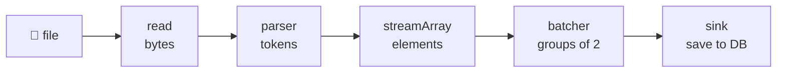
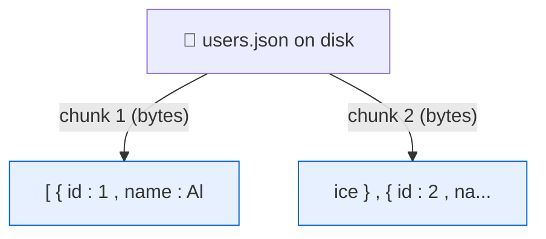
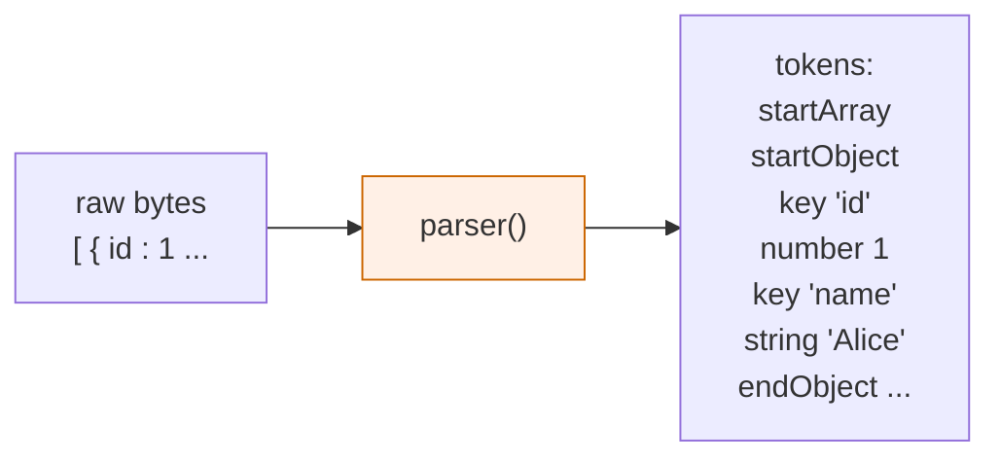
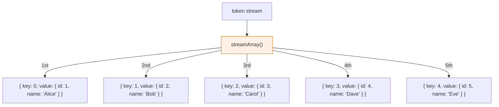
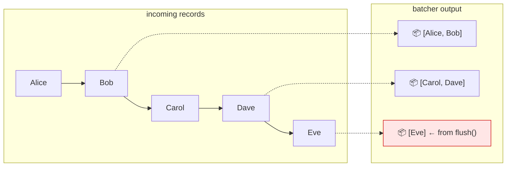
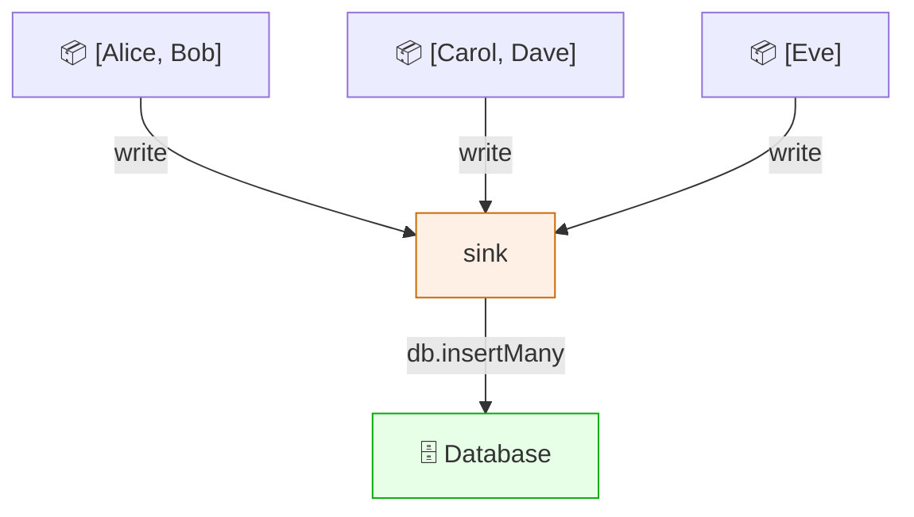
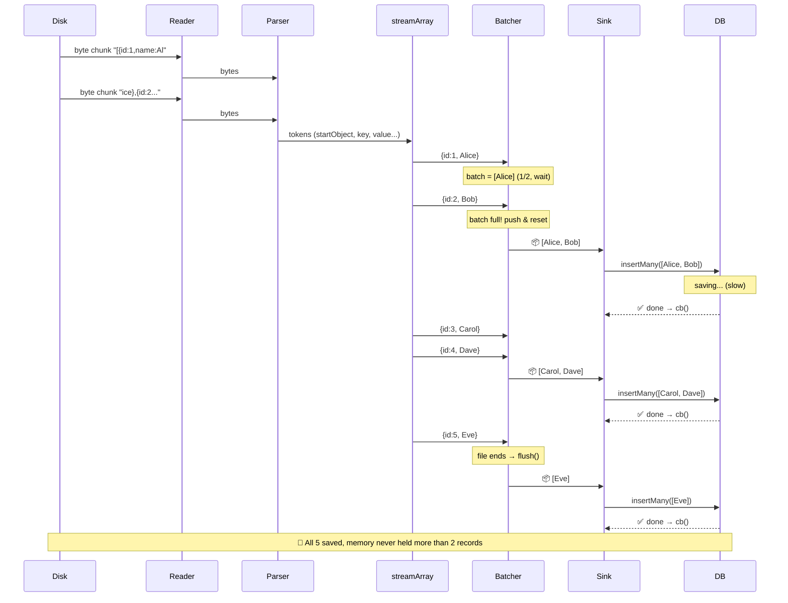
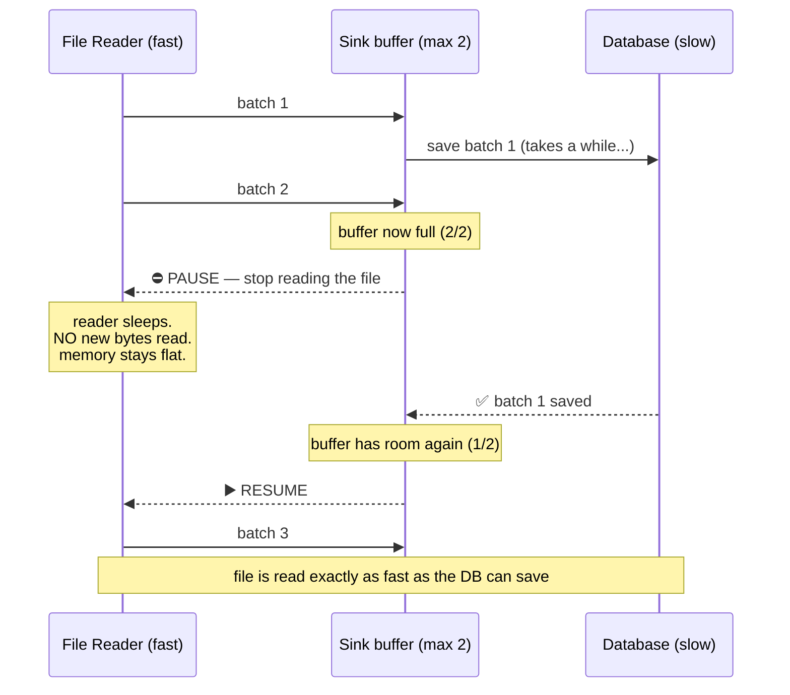
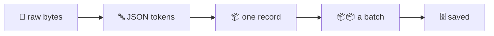

# Streaming JSON — A Concrete Walkthrough (Start to End)

This is the companion to [streaming-big-json.md](streaming-big-json.md). That doc
explained the *concepts*. This one **traces a real (tiny) example through the whole
pipeline**, step by step, so you can *see* exactly what happens to the data at each
stage.

We'll use a **5-record file** and a **batch size of 2** so the whole thing fits on
screen. The same mechanics apply to a 1GB / 1-million-record file — just bigger.

---

## Our example file: `users.json`

Imagine this tiny file on disk (in reality it'd be 1GB, but the logic is identical):

```json
[
  { "id": 1, "name": "Alice" },
  { "id": 2, "name": "Bob" },
  { "id": 3, "name": "Carol" },
  { "id": 4, "name": "Dave" },
  { "id": 5, "name": "Eve" }
]
```

Our goal: save each user to a database, **2 at a time** (our batch size).

Here is the pipeline we're pushing this through:



Now let's watch the data transform at each arrow. ⬇️

---

## Stage 1 — `createReadStream`: file becomes **byte chunks**

The reader does NOT understand JSON. It just reads **raw bytes** off the disk in
blocks (we set 64KB; for this tiny file it might come in 1–2 blocks). It doesn't
care where objects begin or end — a chunk can split right through the middle of a
record.



> 🔑 **Notice:** "Alice" got split across two chunks (`Al` | `ice`). That's totally
> normal. The reader has no idea — it just moves bytes. The *next* stage is
> responsible for making sense of them.

**What's in memory right now:** just one 64KB chunk. Not the whole file.

---

## Stage 2 — `parser()`: bytes become **JSON tokens**

`parser()` (from `stream-json`) is the part that actually *understands JSON syntax*.
It reads the byte chunks and figures out the structure, even when a value was split
across chunks (it remembers where it left off). It emits a stream of **tokens** —
tiny labels describing what it found.

For the start of our file it emits tokens like:

```
startArray
startObject
  startKey → "id" → endKey
  startNumber → "1" → endNumber
  startKey → "name" → endKey
  startString → "Alice" → endString
endObject
startObject
  ...
```



> 🔑 **Why tokens?** Because the parser works incrementally. It can't return "the
> whole array" — that would mean holding everything in memory (the very thing we're
> avoiding). Instead it announces each small structural event as it sees it.

**What's in memory right now:** the current token + a little parser state. Tiny.

---

## Stage 3 — `streamArray()`: tokens become **one element at a time**

`streamArray()` listens to those tokens and is smart enough to know: "we're inside
an array; every time a complete element finishes, hand it over as a real JavaScript
object." It assembles the tokens of *one* element into an object, emits it, and
forgets it.

It emits objects shaped `{ key, value }` where `key` is the array index:



> 🔑 **This is the magic moment.** The 1GB array never exists as one thing in
> memory. We get element #1, then element #2, etc. — and only one lives in memory at
> a time. Whether the array has 5 elements or 50 million, this stage behaves the same.

**What's in memory right now:** one record object (`{ id: 1, name: 'Alice' }`).

---

## Stage 4 — the batcher: elements become **groups of 2**

Saving to a database one row at a time is slow. So our batcher collects records
until it has 2 (our `batchSize`), then pushes the group downstream and starts over.

Let's trace its internal `batch` array as each element arrives:

| Element arrives | `batch` after | Full? | Action |
|---|---|---|---|
| `{id:1, Alice}` | `[Alice]` | no (1/2) | wait |
| `{id:2, Bob}` | `[Alice, Bob]` | ✅ yes (2/2) | **push `[Alice, Bob]`**, reset to `[]` |
| `{id:3, Carol}` | `[Carol]` | no (1/2) | wait |
| `{id:4, Dave}` | `[Carol, Dave]` | ✅ yes (2/2) | **push `[Carol, Dave]`**, reset to `[]` |
| `{id:5, Eve}` | `[Eve]` | no (1/2) | wait |
| *(file ends)* | — | — | **`flush()` pushes leftover `[Eve]`** |



> 🔑 **Why `flush()` matters:** Eve (record #5) never triggers a "batch full" because
> 5 isn't divisible by 2. Without the `flush()` step that runs when the file ends,
> **Eve would be silently dropped.** This is one of the most common streaming bugs.
> `flush()` says "we're done — push whatever's left."

**What's in memory right now:** at most `batchSize` records (here, 2).

---

## Stage 5 — the sink: each batch gets **saved**

The sink receives each batch and does the real work — here, a database insert. Its
`write()` function runs once per batch and calls `cb()` only when the save finishes.



Console output for our example would look like:

```
Processed a batch of 2   ← [Alice, Bob]
Processed a batch of 2   ← [Carol, Dave]
Processed a batch of 1   ← [Eve]
Done! Total records: 5
```

---

## The complete timeline (everything together)

Here's the whole journey as a sequence over time. Watch how only small pieces move
at each step — the full array is never assembled.



---

## Backpressure in action (the slow database)

Now let's make it realistic: the file is huge and the **database is slow**. Watch
how the pipeline *pauses itself* so memory never piles up.

Recall the sink has `highWaterMark: 2` — it will hold at most ~2 batches before
saying "full."



> 🔑 **The whole point:** without backpressure, a fast reader would dump the entire
> 1GB into the sink's queue faster than the DB drains it → memory crash. With it, the
> reader is *throttled by the slowest stage*. `pipeline()` wires these pause/resume
> signals through every stage automatically — you don't write a single line for it.

---

## Try it yourself

Here's a complete, runnable script that generates a sample file and streams it, so
you can watch the batches print. Save as `demo.js` and run `node demo.js`.

```js
'use strict';

const fs = require('fs');
const { pipeline } = require('stream/promises');
const { Transform, Writable } = require('stream');
const { parser } = require('stream-json');
const { streamArray } = require('stream-json/streamers/StreamArray');

// --- Step 0: generate a sample users.json (5 records) ---
const sample = [
  { id: 1, name: 'Alice' },
  { id: 2, name: 'Bob' },
  { id: 3, name: 'Carol' },
  { id: 4, name: 'Dave' },
  { id: 5, name: 'Eve' },
];
fs.writeFileSync('users.json', JSON.stringify(sample, null, 2));

// --- the batcher (groups records) ---
function createBatcher(batchSize) {
  let batch = [];
  return new Transform({
    objectMode: true,
    transform(chunk, _enc, cb) {
      batch.push(chunk.value);
      console.log(`  batcher: added ${chunk.value.name}, batch is now [${batch.map(r => r.name)}]`);
      if (batch.length >= batchSize) {
        console.log(`  batcher: FULL → pushing [${batch.map(r => r.name)}]`);
        this.push(batch);
        batch = [];
      }
      cb();
    },
    flush(cb) {
      if (batch.length) {
        console.log(`  batcher: flush → pushing leftover [${batch.map(r => r.name)}]`);
        this.push(batch);
      }
      cb();
    },
  });
}

// --- the sink (pretend-saves each batch) ---
function createSink(processBatch) {
  return new Writable({
    objectMode: true,
    highWaterMark: 2,
    write(batch, _enc, cb) {
      processBatch(batch).then(() => cb(), cb);
    },
  });
}

// --- wire it all together ---
(async () => {
  let total = 0;
  await pipeline(
    fs.createReadStream('users.json', { highWaterMark: 64 * 1024 }),
    parser(),
    streamArray(),
    createBatcher(2),
    createSink(async (batch) => {
      total += batch.length;
      console.log(`SINK: saved batch of ${batch.length} → [${batch.map(r => r.name)}]`);
    }),
  );
  console.log(`Done! Total records: ${total}`);
})();
```

Expected output (notice the order — records flow one by one, batches fire when full):

```
  batcher: added Alice, batch is now [Alice]
  batcher: added Bob, batch is now [Alice,Bob]
  batcher: FULL → pushing [Alice,Bob]
SINK: saved batch of 2 → [Alice,Bob]
  batcher: added Carol, batch is now [Carol]
  batcher: added Dave, batch is now [Carol,Dave]
  batcher: FULL → pushing [Carol,Dave]
SINK: saved batch of 2 → [Carol,Dave]
  batcher: added Eve, batch is now [Eve]
  batcher: flush → pushing leftover [Eve]
SINK: saved batch of 1 → [Eve]
Done! Total records: 5
```

---

## The mental model to keep

Picture an **assembly line**, not a warehouse:



- Each item moves down the line and is **gone** once it passes.
- The line moves at the speed of its **slowest station** (backpressure).
- At no point does the whole 1GB sit in one place.

That's the entire idea. Everything else — `pipeline()`, `objectMode`,
`highWaterMark`, `flush()` — is just the machinery that makes this assembly line
safe and efficient.
