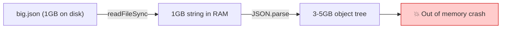
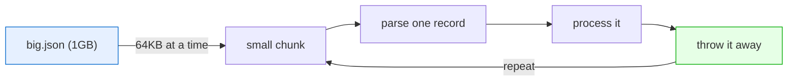
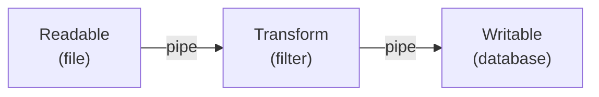
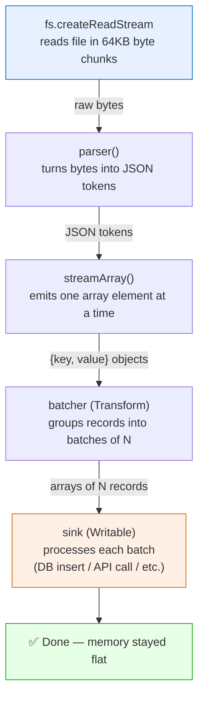
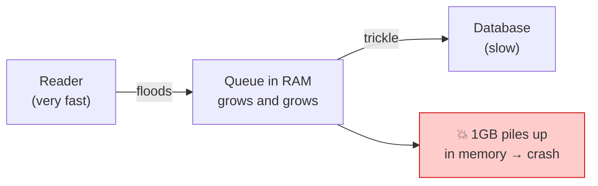
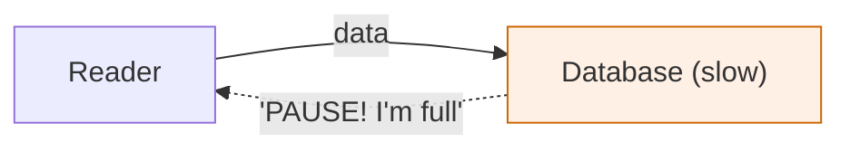
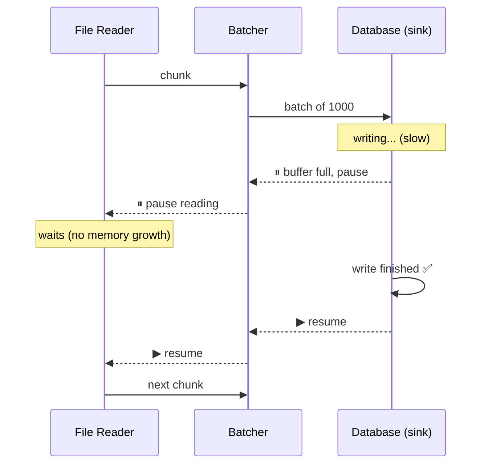
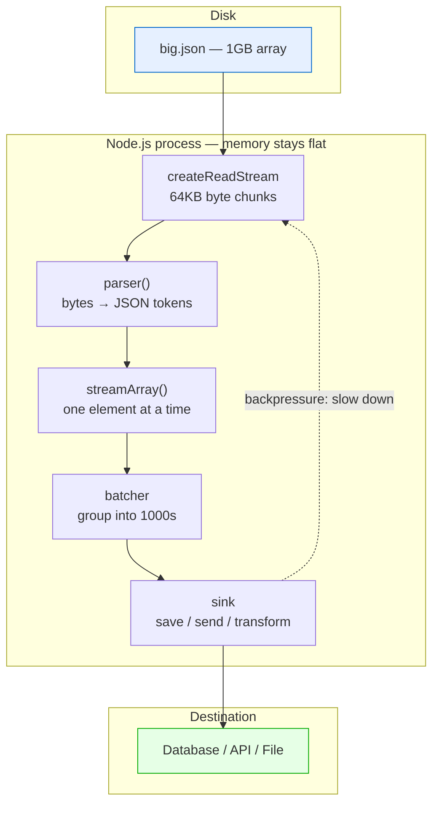

# Streaming a 1GB JSON File in Node.js — A Beginner's Guide

This document explains how to read and process a very large JSON file (e.g. a 1GB
array of objects) in Node.js **without running out of memory**, and why each piece
of the solution exists.

It assumes you are new to Node.js, so every term is explained.

---

## Table of contents

1. [The problem: why you can't just read the file](#1-the-problem)
2. [The big idea: streaming](#2-the-big-idea-streaming)
3. [Core concepts explained](#3-core-concepts-explained)
4. [The architecture (with diagrams)](#4-the-architecture)
5. [The code, explained line by line](#5-the-code-explained)
6. [Backpressure: the most important concept](#6-backpressure)
7. [Why this is the production-grade approach](#7-why-this-is-the-best-approach)
8. [Glossary of terms](#8-glossary)

---

## 1. The problem

The "obvious" way to read a JSON file looks like this:

```js
const fs = require('fs');
const data = JSON.parse(fs.readFileSync('big.json')); // ❌ DON'T do this for 1GB
```

This works fine for small files but **crashes** on a 1GB file. Two reasons:

### Reason A — Memory explosion

- `readFileSync` loads the **entire file into RAM at once** (1GB).
- `JSON.parse` then builds a JavaScript object tree out of it, which can take
  **3–5GB** of additional memory (objects have overhead — keys, pointers, etc.).
- Node.js (via the V8 engine) has a default memory ceiling of roughly **2GB**.
- Result: `JavaScript heap out of memory` → your program dies.

### Reason B — The string length limit

- Before parsing, the whole file becomes one giant JavaScript **string**.
- A single JS string can hold at most ~**512MB** of text (a hard V8 limit).
- A 1GB file can't even fit in one string, so it throws before parsing starts.



**Conclusion:** we must *never* hold the whole file in memory at once.

---

## 2. The big idea: streaming

Instead of loading everything, we process the file **in small pieces, one at a
time**, and throw each piece away once we're done with it.

Think of it like drinking water:

- **`readFileSync`** = trying to swallow an entire swimming pool in one gulp. 💥
- **Streaming** = drinking through a straw, one sip at a time. 🥤

With streaming, memory usage stays **flat** — maybe 50MB — no matter whether the
file is 1GB, 10GB, or 100GB. We only ever hold a few records in memory at once.



---

## 3. Core concepts explained

Before the code, here are the building blocks. Don't worry about memorizing —
refer back as needed.

### 3.1 What is a Stream?

A **stream** is a Node.js object that represents data **flowing over time**,
rather than all at once. Instead of "here is the whole file," a stream says
"here is the next chunk... and the next... and the next..."

There are four kinds:

| Stream type | What it does | Analogy |
|---|---|---|
| **Readable** | Produces data you can read from | A tap (water comes out) |
| **Writable** | Accepts data you write into it | A drain (water goes in) |
| **Transform** | Reads, modifies, then writes (both ends) | A water filter |
| **Duplex** | Readable + Writable, independent | A phone (talk + listen) |

We use all three of the first kinds in our solution.

### 3.2 What is a "chunk"?

A **chunk** is one small piece of data emitted by a stream. When reading a file,
a chunk is a block of bytes (by default 64KB). The stream emits chunk after chunk
until the file is done.

### 3.3 What is `pipe` / piping?

**Piping** connects the output of one stream to the input of another, so data
flows automatically from source to destination — like connecting physical pipes.



### 3.4 What is `pipeline()`?

`pipeline()` is the **modern, safe way** to connect streams. It's a function from
Node's built-in `stream/promises` module. It pipes everything together AND:

- If **any** stream errors, it stops everything and cleans up.
- It **closes the file handle** automatically (avoids resource leaks).
- It returns a **Promise**, so you can `await` it and use try/catch.

The old way (`a.pipe(b).pipe(c)`) does *not* do this cleanup and is considered
unsafe for production. **Always prefer `pipeline()`.**

### 3.5 What is "object mode"?

By default, streams pass around raw **bytes** (Buffers). But we want to pass around
**JavaScript objects** (our parsed records). Setting `objectMode: true` tells a
stream "the things flowing through you are objects, not bytes."

### 3.6 What is `highWaterMark`?

The **highWaterMark** is the size of a stream's internal **buffer** — how much data
it's allowed to hold in memory before it says "stop sending, I'm full."

- For byte streams it's measured in bytes (default 64KB).
- For object-mode streams it's measured in **number of objects**.

This is the dial that controls memory usage. We'll use it to keep memory tiny.

### 3.7 What is `stream-json`?

`stream-json` is a third-party library (`npm install stream-json`) that can parse
JSON **incrementally** — reading the file token by token and emitting each array
element as soon as it's complete, without ever holding the whole array in memory.

Its `streamArray()` helper is built exactly for our case: a file that is one big
JSON array `[ {...}, {...}, ... ]`.

---

## 4. The architecture

Here is the full pipeline we will build:



Each stage does **one job** and hands off to the next. This is the classic Unix
philosophy — small composable pieces — applied to data processing.

### Why each stage exists

| Stage | Why it's there |
|---|---|
| `createReadStream` | Reads the file in small byte chunks instead of all at once. |
| `parser()` | Understands JSON syntax; converts bytes into structured tokens. |
| `streamArray()` | Knows we have an array; emits each element separately. |
| **batcher** | Groups records so we can process 1000 at a time (far faster than 1-by-1). |
| **sink** | Does the actual work (save to DB, call API). Applies backpressure. |

---

## 5. The code, explained

```js
'use strict';

const fs = require('fs');
const { pipeline } = require('stream/promises');     // safe stream connector
const { Transform, Writable } = require('stream');   // base stream classes
const { parser } = require('stream-json');           // incremental JSON parser
const { streamArray } = require('stream-json/streamers/StreamArray');
```

### 5.1 The batcher (a Transform stream)

Processing records one at a time is slow. If each one is a database insert, doing
1000 separate inserts is far slower than one insert of 1000 rows. So we **group**
records into batches.

```js
function createBatcher(batchSize) {
  let batch = [];                          // holds records until batch is full

  return new Transform({
    objectMode: true,                      // we pass objects, not bytes

    // called once per incoming record
    transform(chunk, _enc, cb) {
      batch.push(chunk.value);             // streamArray gives {key, value}; keep value
      if (batch.length >= batchSize) {
        this.push(batch);                  // send the full batch downstream
        batch = [];                        // start a fresh batch
      }
      cb();                                // signal "I'm ready for the next record"
    },

    // called once at the very end, after the last record
    flush(cb) {
      if (batch.length) this.push(batch);  // don't forget the final partial batch!
      cb();
    },
  });
}
```

**Key things to understand:**

- `transform(chunk, enc, cb)` runs **once for each record**. You must call `cb()`
  when done, or the stream freezes (it waits forever for your signal).
- `this.push(x)` sends data to the next stage.
- `flush(cb)` runs **once at the end**. Without it, the last group of records
  (fewer than `batchSize`) would be silently lost — a very common bug.

### 5.2 The sink (a Writable stream)

This is the final destination — where you actually *do something* with the data.

```js
function createSink(processBatch) {
  return new Writable({
    objectMode: true,
    highWaterMark: 2,                      // hold at most ~2 batches in memory

    write(batch, _enc, cb) {
      // processBatch returns a Promise (e.g. a DB write)
      processBatch(batch).then(() => cb(), cb);
      //                          ↑ success   ↑ error
    },
  });
}
```

**Why this creates backpressure (explained fully in section 6):**

- `write()` doesn't call `cb()` until `processBatch` finishes.
- Until `cb()` is called, this stream is "busy."
- With `highWaterMark: 2`, only ~2 batches can queue up before the whole pipeline
  **pauses** — all the way back to reading the file.

### 5.3 Wiring it together with `pipeline()`

```js
async function streamBigArray(filePath, { batchSize = 1000, onBatch }) {
  let recordCount = 0;

  const processBatch = async (batch) => {
    recordCount += batch.length;
    await onBatch(batch, { recordCount });   // your logic goes here
  };

  await pipeline(
    fs.createReadStream(filePath, { highWaterMark: 64 * 1024 }), // 1. read bytes
    parser(),                                                    // 2. parse JSON
    streamArray(),                                               // 3. one elem at a time
    createBatcher(batchSize),                                    // 4. group into batches
    createSink(processBatch),                                    // 5. process each batch
  );

  return { recordCount };
}

module.exports = { streamBigArray };
```

### 5.4 Using it

```js
const { streamBigArray } = require('./streamBigArray');

(async () => {
  try {
    const { recordCount } = await streamBigArray('./big.json', {
      batchSize: 1000,
      onBatch: async (batch) => {
        // await db.insertMany(batch);   // ← your real work
        console.log(`Processed a batch of ${batch.length}`);
      },
    });
    console.log(`Done! Total records: ${recordCount}`);
  } catch (err) {
    console.error('Stream failed:', err);
    process.exitCode = 1;                  // tell the OS we failed
  }
})();
```

---

## 6. Backpressure

**This is the single most important concept** for streaming, so it gets its own
section.

### The problem backpressure solves

Imagine the file reader is **fast** (reads 1GB in seconds) but your database is
**slow** (can only save 1000 records per second). Without any control:



The reader would dump the entire file into a memory queue faster than the database
can drain it — and we're right back to running out of memory.

### How backpressure fixes it

**Backpressure** is the mechanism where a slow consumer tells a fast producer
**"slow down, I'm not ready yet."** The producer pauses until the consumer catches
up.



In our code this happens **automatically** because:

1. The sink's `write()` doesn't call `cb()` until the DB write finishes.
2. While waiting, the sink's buffer fills up to its `highWaterMark` (2 batches).
3. A full buffer signals the batcher to stop → which signals `streamArray` to stop
   → which signals the file reader to stop reading.
4. When the DB finishes, `cb()` fires, the buffer drains, and reading resumes.

The result: the file is read **exactly as fast as your database can handle it**,
and memory stays flat. `pipeline()` is what propagates these pause/resume signals
through every stage for you.



---

## 7. Why this is the best approach

| Concern | How this design handles it |
|---|---|
| **Memory** | Flat (~tens of MB) for any file size, because we never hold the whole file. |
| **Reliability** | `pipeline()` propagates errors and closes the file handle even on failure — no resource leaks. |
| **Speed** | Batching turns thousands of tiny operations into a few big ones (often 10–100x faster). |
| **Safety from overload** | Backpressure prevents a fast reader from flooding a slow writer. |
| **No data loss** | The `flush()` step ensures the final partial batch is processed. |
| **Composability** | Each stage does one job; you can add filtering, validation, or logging stages easily. |
| **Crash visibility** | `process.exitCode = 1` on failure lets schedulers/containers detect the error. |

### Alternatives and why we didn't pick them

- **`JSON.parse(readFileSync(...))`** — crashes on large files (section 1).
- **`readline`** — only works for line-delimited files (NDJSON), not one big array.
- **Loading into a DB's native importer** — great if available, but couples you to
  a specific DB and doesn't let you transform/validate records in JavaScript.

---

## 8. Glossary

| Term | Meaning |
|---|---|
| **Stream** | An object representing data that flows over time, in pieces. |
| **Chunk** | One small piece of data emitted by a stream. |
| **Readable** | A stream you read data *from* (e.g. a file being read). |
| **Writable** | A stream you write data *into* (e.g. saving to a DB). |
| **Transform** | A stream that reads, modifies, and writes (e.g. our batcher). |
| **Pipe / pipeline** | Connecting streams so data flows from one to the next. |
| **`pipeline()`** | The safe, modern function to connect streams with error handling. |
| **Object mode** | A stream setting so it passes JS objects instead of raw bytes. |
| **highWaterMark** | The size of a stream's internal buffer; controls memory use. |
| **Backpressure** | A slow consumer telling a fast producer to slow down. |
| **Buffer** | A chunk of raw binary data (bytes) in memory. |
| **Backlog / queue** | Data waiting in a stream's buffer to be processed. |
| **Sink** | The final destination of the data (where the real work happens). |
| **Batch** | A group of records processed together for efficiency. |
| **V8** | The JavaScript engine Node.js runs on; sets the memory/string limits. |
| **Heap** | The region of memory where your objects live. |
| **`cb` (callback)** | A function you call to signal "I'm done, send the next piece." |

---

## Quick reference: the whole flow in one picture



**The one-sentence summary:** read the file in small pieces, parse and process them
one batch at a time, and let backpressure keep memory flat by reading only as fast
as your destination can handle.
